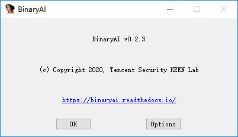
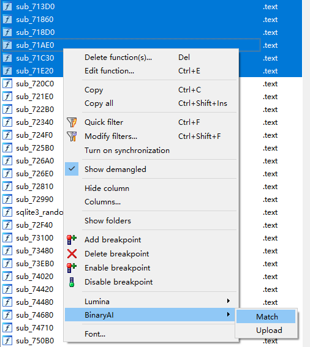
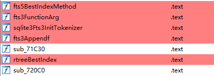
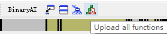

# USAGE


## IDA Pro

### Glossary

**Token** is a string that identifies the user. Please see [Registration]( https://binaryai.readthedocs.io/en/latest/registration.html ) for more information.

**Function set (funcset)** is a set of functions that can be created by users. Users can upload functions to a certain function set, so that users can define the scope of retrieval by themselves.

**Retrieve list** is the scope of retrieval. Users can retrieve in the scope of public or private function set. If private function set is chosen, users need to specify the private function set by its id.

### Shortcuts

|   Shortcut   |          Action           |      Scope      |
| :----------: | :-----------------------: | :-------------: |
| Ctrl+Shift+D | Retrieve current function |     Global      |
|      j       |       Next function       | BinaryAI Widget |
|      k       |     Previous function     | BinaryAI Widget |

### Config

BinaryAI plugin can be configured in two ways: the "Options" dialog box or the`binaryai.cfg` file.

Please modify the default options by the "BinaryAI" button or "BinaryAI" menu (BinaryAI > About) and then clicking the "Options" button.




Or, you can manually edit  `binaryai.cfg`. The default path is as follows. IDA Pro must restart for these changes to take effect.

|     OS      |                 Config File                 |
| :---------: | :-----------------------------------------: |
|   Windows   | %APPDATA%/Hex-Rays/IDA Pro/cfg/binaryai.cfg |
| Linux/macOS |       $HOME/.idapro/cfg/binaryai.cfg        |

The supported options are listed below.

```json
{
    "token": "",
    "url": "http://api.binaryai.tencent.com/v1/endpoint",
    "funcset": "",
    "topk": 10,
    "minsize": 3,
    "threshold": 0.9,
    "usepublic": true,
    "color": "0x817FFF"
}
```

**URL field** specifies the endpoint of BinaryAI web service.

**Topk field** specifies the number of results when the user retrieves a function.

**Minsize field** specifies the minimum basic block size of function. If the basic block size of the function to be matched or retrieved is smaller, the result will not be automatically applied.

**Threshold field** species the minimum score of retrieval result. If the function to be matched or retrieved receives a score lower than the threshold, the result will not be automatically applied.

**Usepublic field** shows the current retrieve list. If the user wants to retrieve from the public function set, it should be set to `true`.

**Color field** defines the color that BinaryAI uses to mark those functions that are successfully matched or applied.

### Match

This command tries to retrieve the selected function(s). 



If successful (score higher than "threshold" and basic block size larger than "minsize"), the function name(s) will be automatically replaced by the name(s) of the result(s) and the function(s) will be marked.



If the result(s) are not satisfactory, it is possible to revert the change(s).

### Match all functions

This command tries to retrieve all functions. 


If successful (score higher than "threshold" and basic block size larger than "minsize"), the function names will be automatically replaced by the names of the results and the functions will be marked.

If the results are not satisfactory, it is possible to revert the changes.

### Retrieve

This command retrieves Top K results of the current function. The user can then select the desired target function and apply it to the current function. If the user applies the wrong function, it is possible to revert the change.


### Upload

This command uploads the selected function(s) to the function set as configured in "Options". The function set can be used as the user's own scope of retrieval. When the user uploads for the first time, it will automatically create a function set.


### Upload all functions

This command uploads all functions to the function set as configured in "Options".  The function set can be used as the user's scope of retrieval. When the user uploads for the first time, it will automatically create a function set.




### Revert

This command reverts the change of the selected functions (name and color) .


## Command Line

```shell
$ binaryai --help
 ____  _                           _    ___
| __ )(_)_ __   __ _ _ __ _   _   / \  |_ _|
|  _ \| | '_ \ / _` | '__| | | | / _ \  | |
| |_) | | | | | (_| | |  | |_| |/ ___ \ | |
|____/|_|_| |_|\__,_|_|   \__, /_/   \_\___|
                          |___/

Usage: binaryai [OPTIONS] COMMAND [ARGS]...

Options:
  -h, --help     show this message and exit.
  -v, --version  show version

Commands:
  create_funcset      create a new function set and add functions if needed
  install_ida_plugin  install IDA plugin
  query_funcset       get function set info by id
  query_function      get function info by given id
```