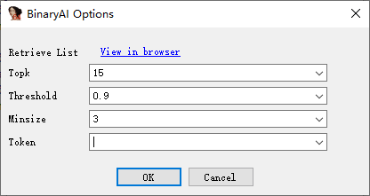
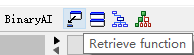
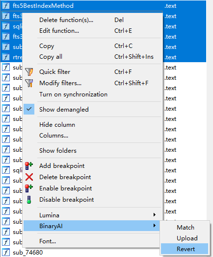

# USAGE


## IDA Pro

### Glossary

**Token** is a string that identifies the user. Please see [Registration]( https://binaryai.readthedocs.io/en/latest/registration.html ) for more information.

**Retrieve list** is the scope of retrieval just like the 'playlist' in the music applications. We have now set it to our official function database. (Users can retrieve in the scope defined by themselves; please refer to the SDK reference part.)

### Shortcuts

|   Shortcut   |          Action           |      Scope      |
| :----------: | :-----------------------: | :-------------: |
| Ctrl+Shift+D | Retrieve current function |     Global      |
|      j       |       Next function       | BinaryAI Widget |
|      k       |     Previous function     | BinaryAI Widget |

### Config

BinaryAI plugin can be configured in two ways: the "Options" dialog box or the `binaryai.cfg` file.

Please modify the default options by the "BinaryAI" button or "BinaryAI" menu (BinaryAI > About) and then clicking the "Options" button.



Or, you can manually edit  `binaryai.cfg`. The default path is as follows. IDA Pro must be restarted for these changes to take effect.

|     OS      |                 Config File                 |
| :---------: | :-----------------------------------------: |
|   Windows   | %APPDATA%/Hex-Rays/IDA Pro/cfg/binaryai.cfg |
| Linux/macOS |       $HOME/.idapro/cfg/binaryai.cfg        |

The supported options are listed below.

```json
{
    "token": "",
    "url": "https://binaryai.tencent.com/api/v3/endpoint",
    "topk": 10,
    "minsize": 5,
    "threshold": 0.90
}
```

**URL field** specifies the endpoint of BinaryAI web service.

**Topk field** specifies the number of results when the user retrieves a function.

**Minsize field** specifies the minimum basic block size of function. If the basic block size of the function to be matched or retrieved is smaller, the result will not be automatically applied.

**Threshold field** specifies the minimum score of retrieval result. If the function to be matched or retrieved receives a score lower than the threshold, the result will not be automatically applied.

### Match

This command tries to retrieve the top-1 similar source codes of the selected function(s) and directly change the name(s) of the function(s) according to the result(s). 


Automatic name replacement and color annotation take place if the score(s) are higher than "threshold" and basic block size(s) are larger than "minsize". Otherwise, the function(s) will be skipped. The darker the color is, the higher the score is.


If the result(s) are not satisfactory, it is possible for the user to manually revert the change(s).

### Match all functions

This command tries to retrieve the top-1 similar source codes of all functions and directly change the names of the functions according to the results. 


Automatic name replacement and color annotation take place when the score(s) are higher than "threshold" and basic block size(s) are larger than "minsize". Otherwise, the functions will be skipped.

If the results are not satisfactory, it is possible for the user to manually revert the changes.

### Retrieve

This command retrieves top-k results of the current function. The user can then select the desired target function and apply it to the current function. If the user applies the wrong function, it is possible to revert the change.



### Revert

This command reverts the change of the selected functions (name and color) .



## Command Line

```shell
$ binaryai --help
 ____  _                           _    ___
| __ )(_)_ __   __ _ _ __ _   _   / \  |_ _|
|  _ \| | '_ \ / _` | '__| | | | / _ \  | |
| |_) | | | | | (_| | |  | |_| |/ ___ \ | |
|____/|_|_| |_|\__,_|_|   \__, /_/   \_\___|
                          |___/

Usage: binaryai [OPTIONS] COMMAND [ARGS]...

Options:
  -h, --help     show this message and exit.
  -v, --version  show version

Commands:
  install_ida_plugin  install IDA plugin
```
